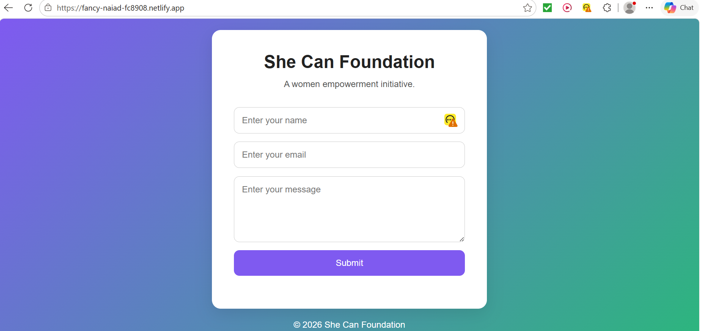
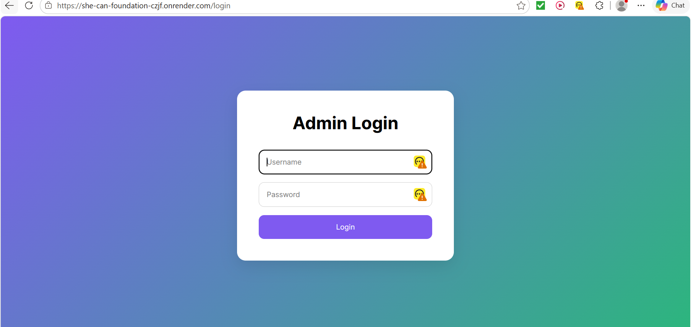
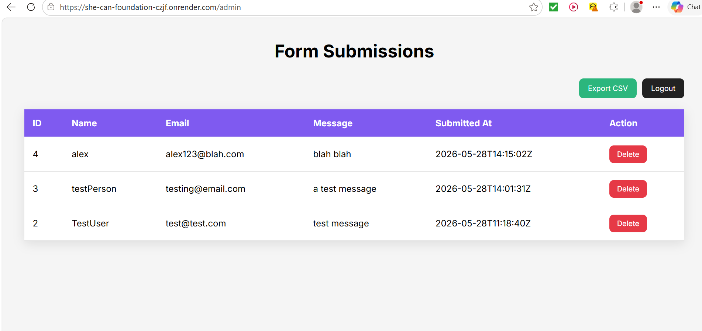

# She Can Foundation — Full Stack Internship Task

A full-stack web app built for the She Can Foundation internship assignment.

Users can submit contact form responses through a responsive frontend interface. Submissions are stored in a SQLite database and managed through a protected admin dashboard.

---

# Live Demo

## Frontend

[Frontend](https://fancy-naiad-fc8908.netlify.app/)

## Admin Dashboard

[Dashboard](https://she-can-foundation-czjf.onrender.com/admin)

---

# Admin Credentials

```text
Username: admin1234
Password: psswrd123
```

---

# Features

## User Features

* Submit contact form
* Responsive design
* Form validation
* Animated toast notifications
* Smooth UI interactions
* Mobile-friendly layout

---

## Admin Features

* Admin auth
* View all submissions
* Delete submissions
* Export submissions as CSV
* Timestamped submissions
* Secure route protection

---

# Tech Stack

## Frontend

* HTML
* CSS
* JavaScript

## Backend

* Go (`net/http`)
* SQLite

---

# Project Structure

```text
she-can-foundation/
│
├── frontend/
│   ├── index.html
│   ├── style.css
│   └── script.js
│
├── backend/
│   ├── main.go
│   ├── admin.html
│   ├── login.html
│   ├── submissions.db
│   ├── go.mod
│   └── go.sum
│
├── README.md
└── .gitignore
```

---

# API Endpoint

## Submit Form

```http
POST /submit
```

### Example Request

```json
{
  "name": "Rahul",
  "email": "rahul@example.com",
  "message": "Hello"
}
```

### Example Response

```json
{
  "success": true
}
```

---

# Local Setup Instructions

## 1. Clone Repository

```bash
git clone https://github.com/rahullpanditaa/she-can-foundation
```

---

## 2. Start Backend

Navigate into backend folder:

```bash
cd backend
```

Install SQLite driver:

```bash
go get github.com/mattn/go-sqlite3
```

Run backend server:

```bash
go run .
```

Backend runs on:

```text
http://localhost:8080
```

---

## 3. Start Frontend

Open another terminal.
Navigate into frontend folder:

```bash
cd frontend
```

Run local server:

```bash
python3 -m http.server 8000
```

Frontend runs on:

```text
http://localhost:8000
```

---

# Admin Routes

## Login Page

```text
/backend/login
```

## Admin Dashboard

```text
/backend/admin
```

## Export CSV

```text
/backend/export
```

---

# Screenshots

## Homepage



---

## Login Page



---

## Admin Dashboard



---